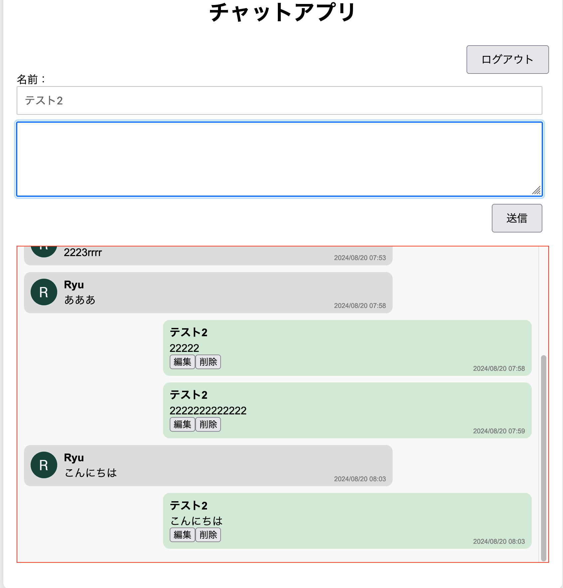

## ①課題番号-プロダクト名

チャットアプリ（Google認証版）

## ②課題内容（どんな作品か）

### Googleアカウントを使ってチャットができるアプリ

- Googleアカウントを使ってログインすることで、Googleアカウントの名前でチャットができる
  - Google側での名前変更にも対応
  - 別ブラウザからログインしても、ユーザIDによって識別される
- Googleアカウントのプロフィール画像を使ってアイコンを表示
- チャットの内容はリアルタイムで更新される
- チャットの内容はブラウザを閉じても保持される
- 自身のメッセージの編集と削除が可能
- メッセージの送信時刻を表示

## ③DEMO

https://tech-ryu.sakura.ne.jp/chat-app/

## ④作ったアプリケーション用のIDまたはPasswordがある場合

任意のGoogleアカウントでログインが必要

## ⑤工夫した点・こだわった点

- 編集・削除時にわかりやすいポップアップ画面を表示
- 自身のメッセージは右側に表示、他のユーザのメッセージは左側に表示することで、実際のチャットアプリのように見やすくした
- ユーザアイコンをGoogleアカウントから取得して表示

## ⑥難しかった点・次回トライしたいこと(又は機能)

### 難しかった点

- ユーザ情報を別のテーブルから取得するようにしたときに表示順が崩れてしまい、日時順に表示されなくなってしまった
  - ユーザ情報をあらかじめ取得しておくことで一旦解決したが、もっとスマートな方法があるはず

### 次回トライしたいこと

- 画像やスタンプなど文字以外の要素を送信できるようにしたい
  
## ⑦質問・疑問・感想、シェアしたいこと等なんでも

- [質問]
- [感想]
  - FirebaseのGoogle認証はサンプルが豊富なため、グイン機能を簡単に実装できた
  - 一覧表示のループ内に、他のDBへのアクセスをawait（非同期処理）で入れたことで、想定する挙動と異なる動作をした。最初はなぜ順序が変わるのかわからず、苦労した。
- [参考記事]